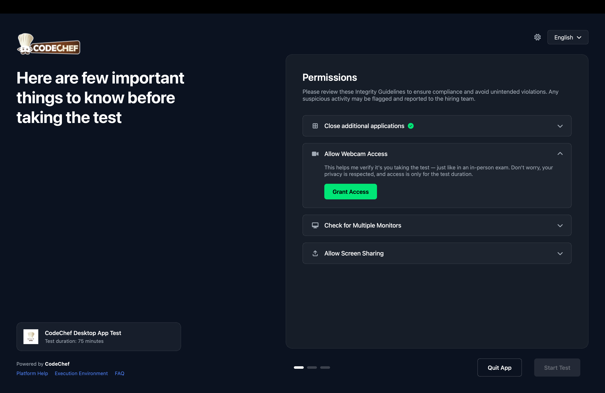
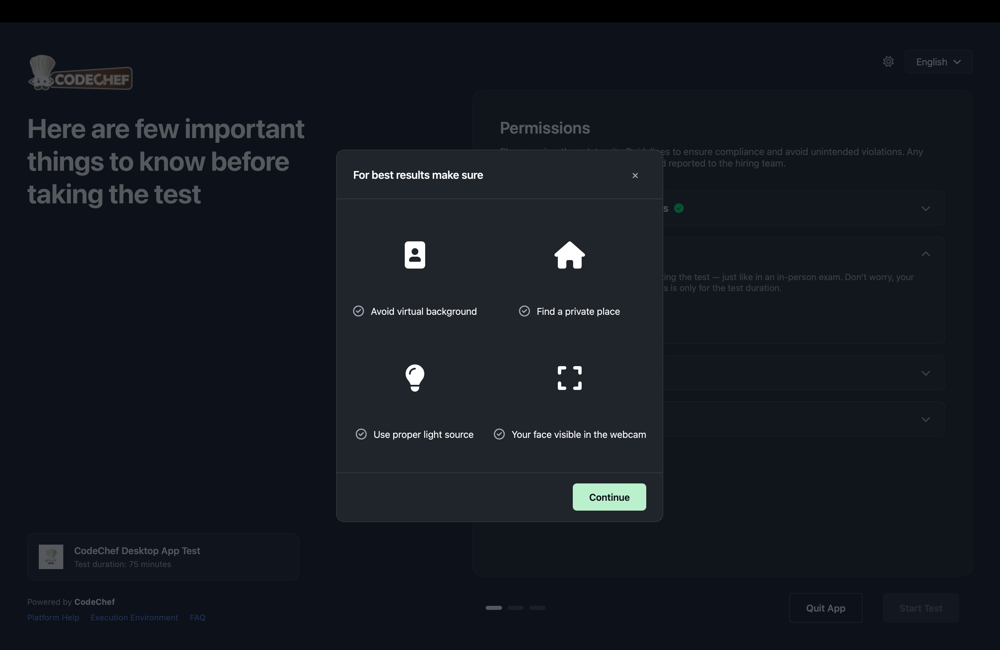
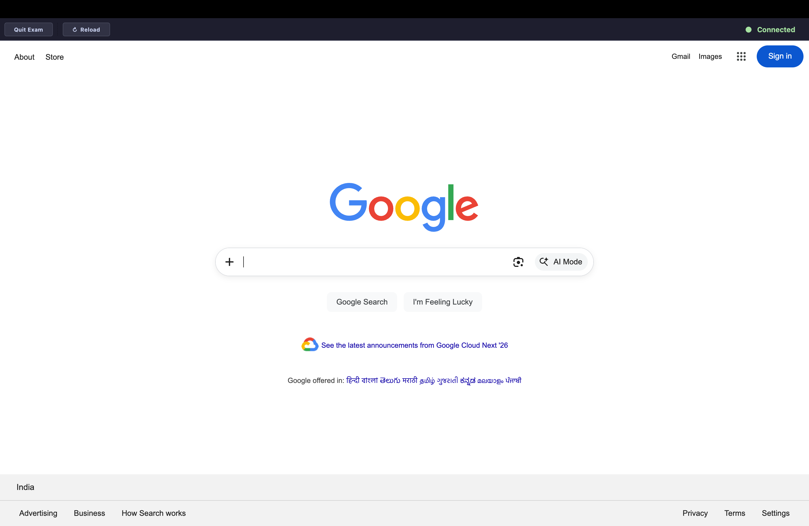
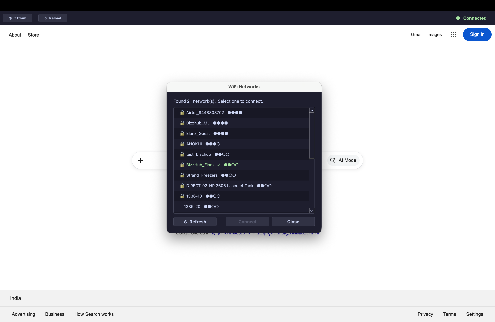
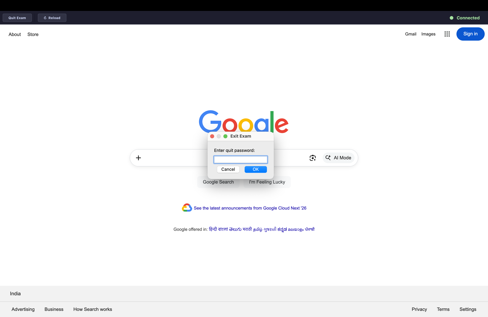

# SecureExamBrowser

## Features

- Launches a locked-down exam browser window with a configurable start URL.
- Enforces kiosk-style system guard behavior during the exam session.
- Monitors internet connectivity throughout the session.
- Integrates Wi-Fi management helpers for supported platforms.
- Terminates deny-listed remote desktop and remote support apps automatically.
- Detects suspicious remote-access connections by known domains and ports.

## Installation

- Windows: download [SecureExamBrowser.exe](https://github.com/PushpenderIndia/SecureExamBrowser/releases/latest/download/SecureExamBrowser.exe) and run it.
- Linux: download [SecureExamBrowser-linux](https://github.com/PushpenderIndia/SecureExamBrowser/releases/latest/download/SecureExamBrowser-linux), run `chmod +x SecureExamBrowser-linux`, then start it.
- macOS (Apple Silicon): download [SecureExamBrowser-macos-arm64.zip](https://github.com/PushpenderIndia/SecureExamBrowser/releases/latest/download/SecureExamBrowser-macos-arm64.zip), unzip it, then run `xattr -dr com.apple.quarantine SecureExamBrowser.app` before opening it because the app is not signed.
- macOS (Intel): download [SecureExamBrowser-macos-intel.zip](https://github.com/PushpenderIndia/SecureExamBrowser/releases/latest/download/SecureExamBrowser-macos-intel.zip), unzip it, then run `xattr -dr com.apple.quarantine SecureExamBrowser.app` before opening it because the app is not signed.

## Screenshots

### 1. App Start Screen

### 2. Web Cam Advisory Modal

### 3. SecureExamBrowser opens your start exam 

### 4. User can switch to another WiFi from the SEB itself

### 5. Quit Exam using Admin Password 

### 6. Moveable AI Web Cam Proctor 

